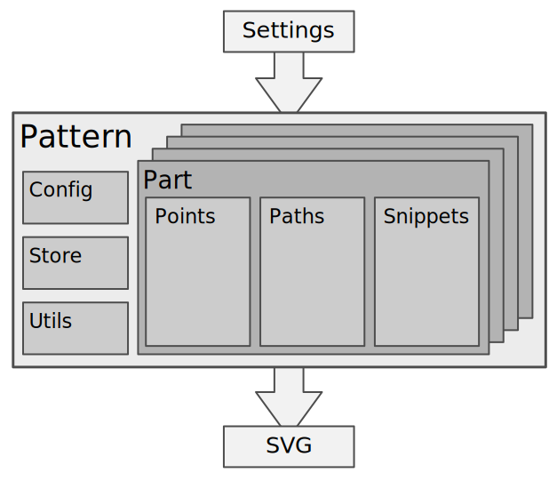

Freesewing est une librairie en JavaScript pour patrons de couture sur mesure.  
Ou, plus généralement, c'est une boîte à outils pour concevoir de façon paramétrique des dessins en 2D.

## Construire des blocs

Créer un patron avec freesewing est assez similaire à ce que l'on ferait sur du papier. 
Vous avez besoin des mêmes outils, mais ils sont à présent sous forme de code.

Vous utilisez freesewing pour développer des **patrons** (pattern). Vous finirez par exporter une méthode de construction de 
[Patron](/fr/docs/developer/api/pattern) :

Un patron vient avec une [configuration](/fr/docs/developer/config) et 
un [entrepôt](/en/docs/developer/api/store) (store) et agit comme un contenant pour les 
[parties](/en/docs/developer/api/part) (part) de votre patron.

Le travail principal est fait dans ces **parties**. Elles contiennent l'information qui permet la construction de votre patron. 
Les [points](/fr/docs/developer/api/point) dont nous avons besoin pour dessiner 
les [chemins](/fr/docs/developer/api/path) (paths) et peut-être également quelques 
[fragments](/fr/docs/developer/api/snippet) (snippets). Ce sont des embellissements réutilisables 
que vous pouvez ajouter à votre patron. Comme un cran, un bouton, et ainsi de suite.

Dans un scénario typique, votre patron sera instancié avec un ensemble de 
réglages utilisateur, après l'avoir [ébauché et rendu](#draftvsrender), il sortira sous forme de 
SVG.

## Héritage

Les patrons de couture sont rarement conçus à partir de rien. Un patron est généralement basé sur un patron de base, ou un autre patron.
Le patron d'une chemise western peut être basé sur celui d'une chemise boutonnée, qui lui-même peut-être basé sur un patron
de base de buste masculin, vous voyez où je veux en venir.

En programmation, nous appelons cela l'*héritage*. Vous souhaitez peut être partir de rien, 
mais bien souvent, vous démarrez de quelque chose qui est déjà à mi-chemin de ce que vous souhaitez obtenir.

Par exemple, la patron Jaeger de freesewing est basée sur Bent, qui lui-même est basé sur Brian.

## Options

Pour un patron papier, les choses sont telles qu'elles sont. Pour un patron codé en revanche, 
il est possible de donner des choix. Manches longues ? Manches courtes ? Un peu plus d'aisance au niveau de la taille ? 
Ou ajusté comme un gant ?

Vous pouvez en apprendre plus sur tous les types d'option que freesewing prend en charge dans 
la documentation sur la [configuration](/fr/docs/developer/config).
