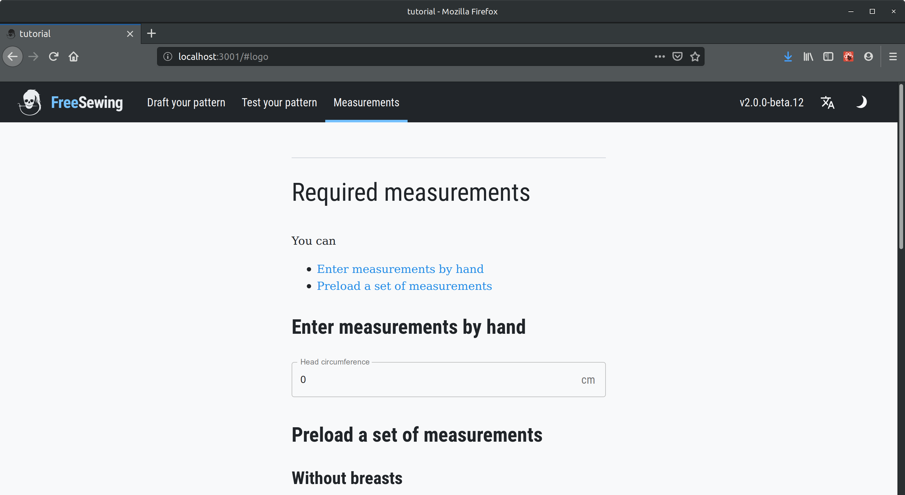

L'essence de FreeSewing est de réaliser des patrons de couture *sur mesure* ; Nous allons ébaucher notre patron selon les mesures qui nous sont fournies.

Ce qui nous amène à cette question : quelles mesures ?

C'est vous, en tant que concepteur de patron, qui décidez de quelles mesures vont être requises pour ébaucher votre patron. Pour notre bavoir, la seule mesure dont nous avons besoin est le *tour de tête* du bébé (*headCircumference*).

Alors ajoutons-le comme mesure nécessaire.

## Ajouter les mesures nécessaires

Ouvrez le fichier de configuration à l'adresse `config/index.js` et mettez à jour le tableau `measurements` avec le nom des mesures requises :

```js
measurements: ["headCircumference"],
```

<Tip>

Assurez-vous d'employer les noms de mesures existantes, plutôt que d'inventer les vôtres.

Voyez nos [ meilleures pratiques](do/names#re-use-measurements) sur ce sujet pour plus de détails.

</Tip>

A présent tout le monde sait que votre patron a besoin de la mesure `headCircumference`.

Ce changement sera également repris par l'environnement de programmation, et vous verrez alors à l'écran :



Etant donné qu'il n'y a qu'une seule mesure, rentrons simplement une valeur à la main. Par exemple, `38` pour 38 cm est une mesure de tour de tête réaliste pour un bébé.

Entrez `38` dans le cadre, puis cliquez sur **Ebaucher votre patron** dans la barre de navigation supérieure pour revenir à votre ébauche, qui pour le moment ressemble encore à ça :

<example pattern="tutorial" part="step1" caption="Nothing has changed, yet" />