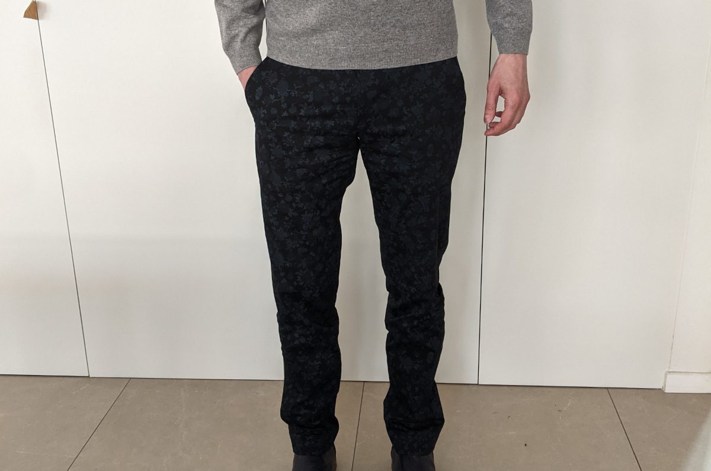

Wir haben soeben FreeSewing v2.15 veröffentlicht und es kommt mit einem neuen Muster: [Das Charlie Chinohosenmuster](/designs/charlie/).

Ich habe den Überblick darüber verloren, wie lange ein Schnittmuster für Chinos schon auf meiner To-Do Liste stand, aber die verwendete Einheit ist sicher Jahre. Ich bin sehr froh, dass ich endlich dort angekommen bin, wo ich hin wollte.

Hier ist ein Bild davon, aber durch den dunklen Stoff erkennt man leider nicht so viel:

Stattdessen erzähle ich dir lieber, warum ich hierüber so begeistert bin.

##### Basierend auf Titan

Vorweg: Charlie basiert auf Titan, unserem Unisex-Hosengrundschnitt, der auch die Grundlage für [unseren Paco-Schnitt](/designs/paco/) ist. Wenn du also diese Schitte kennst, weißt du schon, wie dir Charlie passen wird.

##### Mehr Körpermaße, mehr Optionen, besserer Sitz

Um zu zeigen, für wie groß ich diese Verbesserung halte, habe ich [Theo](/designs/theo/) als veraltet markiert. Da Theo auf der Aldrich-Entwurfsmethode basiert, werden dort nur sehr wenige Körpermaße verwendet. Das funktioniert zwar gut für einige bestimmte Leute, ist aber dadurch nicht sehr vielseitig.

Charlie passt sich unterschiedlich geformten Körpern besser an, und hat verdammt viele Optionen, die es dir ermöglichen, deine Hose so zu konfigurieren wie du sie haben willst. Falls du dich fragst: Theo hat 5 Optionen, während es bei Charlie 31 sind.

Trotzallem werden wir Theo weiter zur Verfügung stellen. Veraltet bedeutet nur, dass wir eine kleine Warnmeldung hinzugefügt haben, die dir sagt, dass wir stattdessen Charlie empfehlen.

##### Einfacher zu fertigen

Another reason to opt for Charlie rather than Theo: Charlie is easier to make. It has a more straight-forward fly and waistband construction, and the front pockets have been cleverly designed to give you the ease of construction that comes with side-seam pockets, yet the classic look of slanted pockets.

Theo ranks 4 stars on our difficulty scale, and I've given Charlie 3 stars. If you were afraid of making trousers, this might be the pattern you've been waiting for.

##### Real pockets

Charlie is a unisex pattern and the pockets are real. You have welt (aka jetted) pockets at the back, and slanted pockets at the front. In both cases, you have control over the size and depth of the pockets.

The front pockets deserve a special mention. They look like traditional slanted pockets, but are set in on the side seam. To make that possible, the back panel of the trousers wraps around the front, following the pocket slant.

## Other 2.15 news

Charlie is the main act, but there's a lot of work that went in this 2.15 release.

As always, [the changelog](https://github.com/freesewing/freesewing/blob/develop/CHANGELOG.md) has all the details, but allow me to highlight some of the more noteworthy changes:

 - We have [a new bartack plugin](https://freesewing.dev/reference/plugins/bartack/)
 - The [buttons plugin](https://freesewing.dev/reference/plugins/buttons/) provides new [buttonhole-start](https://freesewing.dev/reference/snippets/buttonhole-start) and [buttonhole-end](https://freesewing.dev/reference/snippets/buttonhole-end) snippets
 - The [dimension plugin](https://freesewing.dev/reference/plugins/dimension/) provides a new [rmad macro](https://freesewing.dev/reference/macros/rmad/)
 - The [logo plugin](https://freesewing.dev/reference/plugins/logo/) now supports dark mode
 - Titan and Paco have a new `waistbandHeight` option
 - Core no longer rounds point coordinates to avoid misses when using [path.split](https://freesewing.dev/reference/api/path/split/)
 - [Bella](/designs/bella/) has a fix to the shoulder to better accommodate doll-sized clothing
 - [Charlie](/designs/charlie/) is the first pattern to list some of the absolute dimensions when configuring a pattern, but we plan to extend this to other designs We have documented [the new raise methods](https://freesewing.dev/reference/api/part/raise) for designers who want to utilize this feature.
 - Speaking of documentation, the examples in our [documentation for developers](https://freesewing.dev/) now allows you to toggle a switch to reveal the points and paths in the examples
 - The [part.getId()](https://freesewing.dev/reference/api/part/getid/) method now takes a prefix argument

