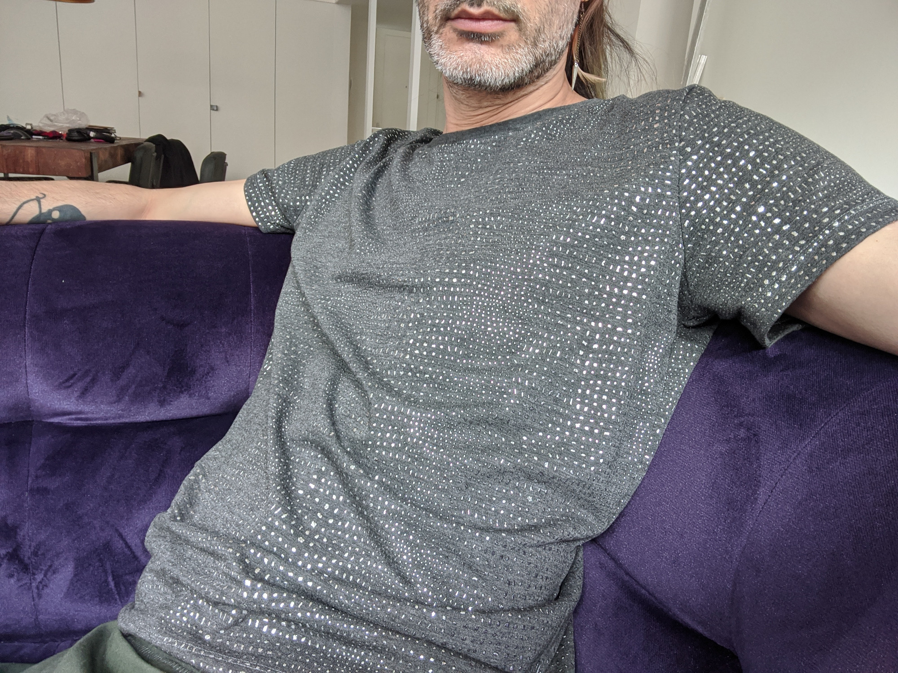
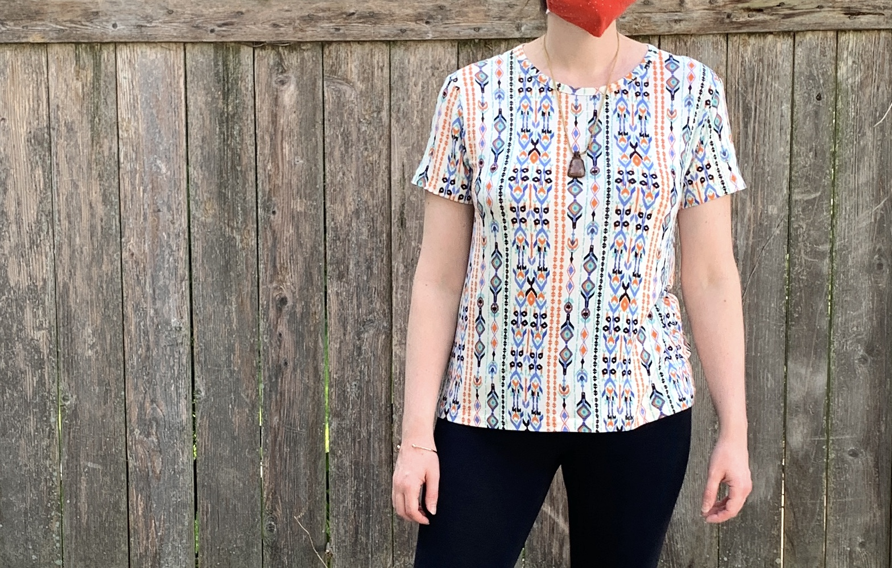

import LineDrawing from '@freesewing/components/LineDrawing'

A while ago somebody asked whether we had a T-shirt pattern on freesewing.org and it turns out, we didn't.

There's no good reason for that, we just never got around to that. So today we're rolling out version 2.9 of FreeSewing with our latest pattern: [the Teagan T-shirt](/designs/teagan/).

<LineDrawing pattern='teagan' />

## Who is this for?

Teagan is fitted T-shirt pattern with options for altering the neckline, length, and sleeves.

Teagan is based on [our Brian block](/designs/brian/), which does not take breasts into account. That being said, this will work for people with breasts too. Since it uses the chest circumference it will simply draft a T-shirt to fit your full chest.

We've also added an option to draft this to your high bust, which would give you a more fitted T-shirt with ease & stretch having to accomodate for your breasts.

## Community Updates

If you're thinking about sewing Teagan, but you're new to sewing or working with knits, never fear! FreeSewing has more support than ever. Chat with us on [Discord](https://chat.freesewing.org/), in a [Facebook Group](https://www.facebook.com/groups/627769821272714), or on [Reddit](https://www.reddit.com/r/freesewing/). Find us on social as @freesewing_org on [Instagram](https://www.instagram.com/freesewing_org/) and [Twitter](https://twitter.com/freesewing_org). If you're looking for tutorials, there's a new [YouTube channel](https://www.youtube.com/channel/UCLAyxEL72gHvuKBpa-GmCvQ) for that. It has a whole series on [sewing up Teagan](https://www.youtube.com/playlist?list=PLY9EmRuXR20Y7FonIHD6mX9yIpFh_emX1), as well as this amazing preview.

<!--- If this breaks, what I was trying to do is make a picture be a link pointing to the YouTube video, because
apparently we can't just embed one. :unamused: Also, change where this is pointing if we move the link to the 
FreeSewing YouTube channel. --->

If all of this sounds awesome, and you want to get more involved with FreeSewing, you can check out our repositories and source code on [Github](https://github.com/freesewing/) or connect with other contributors via [Zoom](https://meet.freesewing.org./). You can find announcements about upcoming contributor calls on Discord, in the announcements channel.

And if you sew up a Teagan T-shirt, let us know what you think!
