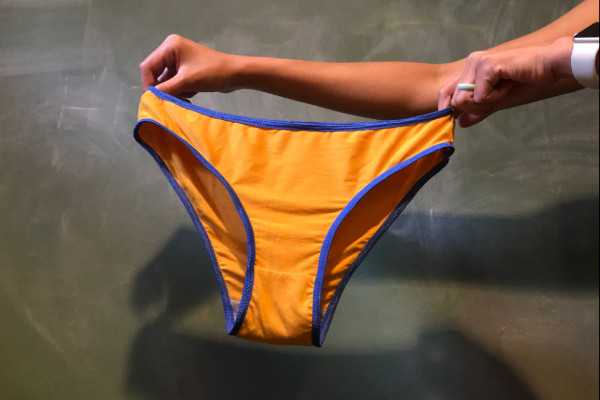

FreeSewing 2.17 is out, and it while it comes with many fixes and improvements,
the biggest news is certainly a brand new pattern: [The Ursula Undies](/designs/ursula/)
by US-based designer Natalia Sayang.

The picture above is from [this showcase post](/showcase/ursula-test-pairs/)
which includes several more examples of the different styles you can accomplish with
this versatile pattern.

Ursula is a quick make, not to mention the ultimate stash-buster.
We are really excited about it.
