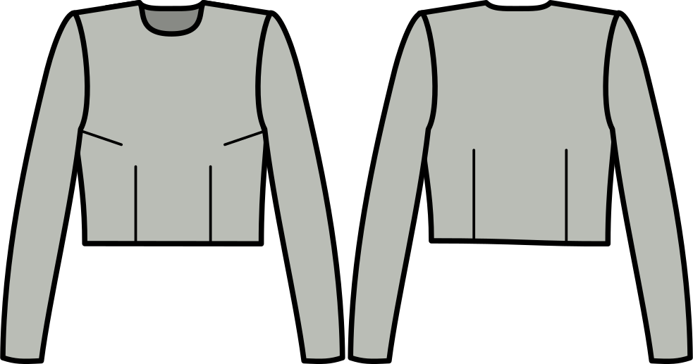

Version 2.2 of FreeSewing is here, and it has a bunch of changes and improvements big and small. The [changelog](https://github.com/freesewing/freesewing/blob/develop/CHANGELOG.md) lists all the changes, but here's what you need to know:

 - [New pattern: Breanna is a bodice block for womenswear](#new-pattern-breanna-is-a-bodice-block-for-womenswear)
 - [New/Different measurements to better suit womenswear](#newdifferent-measurements-to-better-suit-womenswear)
 - [Generate patterns in *standard* sizes (no account required)](#generate-patterns-in-standard-sizes-no-account-required)

Let's have a look at what it all means:

## New pattern: Breanna is a bodice block for womenswear

Meet [Breanna](/designs/breanna/), our bodice block for womenswear.

A block or sloper is not the most exciting pattern to look at, but plays an important role as it is the basic fit which other patterns are built on. We have a similar block for menswear called [Brian](/designs/brian/) and our [Aaron](/designs/aaron/), [Bent](/designs/bent/), [Carltia](/designs/carlita/), [Carlton](/designs/carlton/), [Huey](/designs/huey/), [Hugo](/designs/hugo/), [Jaeger](/designs/jaeger/), [Simon](/designs/simon/), [Simone](/designs/simone/), [Sven](/designs/sven/), and [Wahid](/designs/wahid/) patterns all can trace their lineage back to Brain. In other words, it's an important building block for us to extend our womenswear collection.

But that doesn't mean it's not good news for you too. If you've been sewing for a while, chances are drafting your own block/sloper has perpetually been on your to-do list. Well, good news, because here's your block ready to go.

Oh, and of course it's got all the bells and whistles you've come to expect from us. Have a look at [the pattern options](http://localhost:8000/docs/patterns/breanna/options/) and I think you'll be positively impressed. If nothing else, this block can accommodate 1 or 2 bust darts in 15 different places, giving you 120 unique ways to place your bust dart(s).

This block has been a while in the making, and we'd love to get your feedback on this. Making a muslin of a block like this really isn't much work, so if you've got some time to spare to whip this one up and let us know how it went, that would be great.

## New/Different measurements to better suit womenswear

Now that we're making our jouney into womenswear, we realized that the measurements we use on the site are somewhat skewed towards menswear. In addition, we had a lot of people stuggling with the shoulder slope measurement. So we decided to re-visit our measuremets, and we've made the following changes:

### We have a bunch of new *HPS* measurements

We've settled on the High-Point Shoulder, the so-called HPS point, as the basis for many of the vertical torso measurements. If you're not certain what/where the HPS point is, [check the HPS documentation](/docs/measurements/hps/).

### We discontinued the Center Back To Neck measurement

As we mentioned earlier, we use measurements from the HPS point instead. This measurement was removed, which also means that if you had this measurement in your own data, it is now gone and you may need to add another measurement for certain patterns.

### We changed the way the shoulder slope is measured

We noticed that people struggles with the way we asked them to measure [the shoulder slope measurement](/docs/measurements/shoulderslope) so we have changed how to do that.

Because the new method yields a very different number (that ultimately captures the same thing, how much your shoulder slopes downward) here too we had to go in and reset all the existing data. In other words, you'll have to re-measure your shoulder slope.

## Generate patterns in *standard* sizes (no account required

To get great pattern, you need accurate measurements, and a bunch of them. It's what we do here at FreeSewing, and most of the problems with patterns are because something goes wrong with taking measurements.

Unfortunately, there is no magic shortcut for this. If you want something made-to-measure, it's always going to start with acurate measurements.

This does raise the bar for people who are new to the site, and want to kick the tires. *Oooh, free patterns, nice. Wait, I have to create an account first? And take all these measurements? That seems like a lot of work.*

But our regular visitors would often like to get to see a pattern and play around with it without first having to put in a bunch of measurements.

So *drumroll* that is no longer required. We now offer all our patterns in *standard sizes*. Not only do you not have to take measurements to try out the patterns, you don't even have to sign up or log in. No account needed, just pick a pattern, a size, and you're good to go.

Obvously, made-to-measure patterns is *our thing*, and we're not changing that. But we're hoping that by lowering the bar to try out our platform, more people will overcome their initial skepticism and give FreeSewing a try.

### What are standard sizes anyway?

The hardest thing about adding support for standard sizes? Figuring out what the heck standard sizes are supposed to be in the first place. We took a stab at it, and if you're curious you can [check out our sizing table here](/docs/about/sizes/).

For menswear, our size range is 32 to 50, and they are based on a size 38 baseline that we then graded up and down. For womenswear, our size range is 28 to 48, and they are based on a size 34 baseline that we then graded up and down.

While we tried to make our size ranges inclusive, and these tables are an honest attempt to come up with something that makes sense, please understand that this is not our core business. We've love to hear your feedaback on the sizing tables, and are open to tweaks and suggestions, but at the end of the day, what we want is to give you a pattern drafted to your measurements.

## Oh yeah, and all the other stuff

Now go and click around, for we've changed a bunch of other stuff too to make the site more intuitive.

If you bump into any problems or have questions, as always [our chat room is the place to get in touch](https://gitter.im/freesewing/chat).

And if you happen to like what we do here, perhaps now is a good time to tell your friends about FreeSewing. After all, they can check it out now without even needing to sign up.

PS: We have [a handy share page](/share/) you can use for this.

