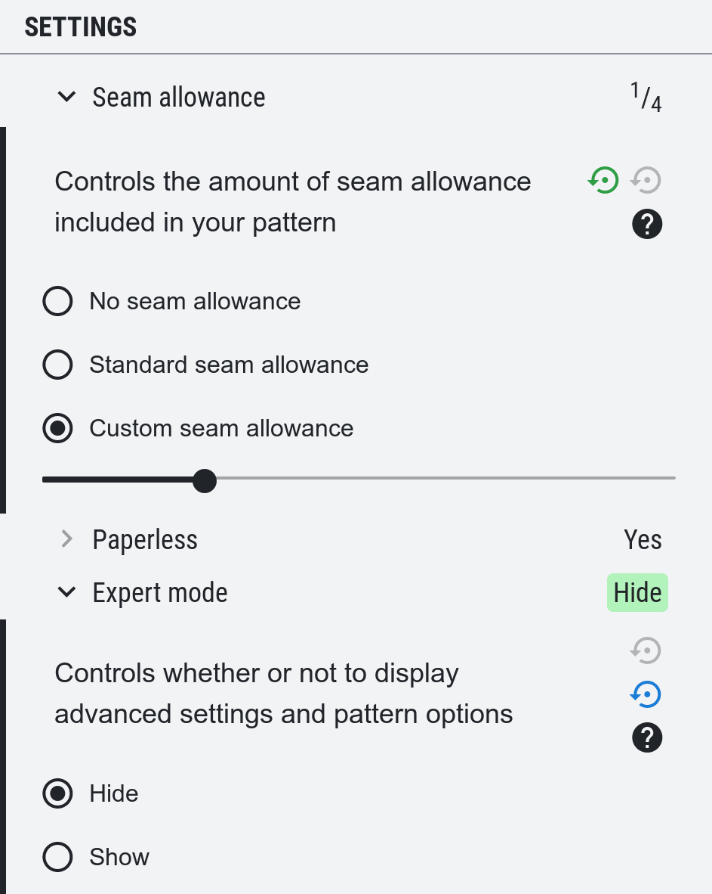

Nous venons juste de publier FreeSewing v2.1 <unk> 🎉

## Rencontrez Pénelope, Waralee et Simone

Il y a 3 nouveaux modèles dans cette nouvelle version :

 - [Penelope](/patterns/penelope) est une jupe crayon de [Wouter Van Wageningen](/users/wouter.vdub)
 - [Waralee](/patterns/waralee) est un pantalon "pareo" (aussi dit thaïlandais), aussi de [Wouter](/users/wouter.vdub)
 - [Simone](/patterns/simone) est Simon (notre versatile patron boutonné) adapté pour les seins, de [Joost De Cock](/users/joost)

Tous ces patrons sont des vêtements féminins ou -- dans le cas de Waralee -- unisexes. Ceci est donc une démonstration de notre engagement à apporter plus de modèles de vêtements féminins sur le site.

En plus de créer de nouveaux modèles, de nombreux efforts ont été réalisés pour simplifier les choses, sans les rendre plus limitées. Je m’explique :

## Notre travail sur la révélation progressive

Trouver un équilibre entre donner à nos utilisateurs toute la puissance de la plate-forme, tout en facilitant le démarrage des nouveaux arrivants, est un défi permanent. Nous avons commencé à faire des progrès dans la résolution de ce problème avec ce que l'on appelle *révélation progressive de la complexité*.

L'idée -- que nous n'avons pas inventée, mais c'est un concept dans la conception d'UX (= expérience utilisateur) -- est de simplifier l'expérience pour la majorité des gens sans limiter les capacités des utilisateurs plus avancés.

Nous concentrons notre attention pour la révélation progressive sur deux sujets pour lesquels nos utilisateurs débattent le plus souvent :

 - **Options des patrons** : Nos patrons offrent souvent une douzaine d'options. C'est génial pour ceux qui aiment affiner chaque détail de leur modèle, mais peut-être un peu accablant pour les nouveaux arrivants
 - **Mesures**: Il est essentiel de prendre des mesures précises pour obtenir de bons résultats avec nos modèles ; ce n'est pas aussi futile que vous le pensez.

Bien que nous n'en soyons certainement pas encore là, nous avons fait des progrès sur ces deux points. Voyons ce que nous avons déjà réussi :

### Options de patron : Nous avons maintenant un mode expert, et il est désactivé par défaut

(certains de) Nos patrons ont des *options avancées* depuis un certain temps, mais ils sont maintenant cachés par défaut. Ceci jusqu'à ce que vous activez le **Mode Expert** dans les paramètres (ci-dessous les options de patron).

Hormis les options avancées de patron, le mode export révèle également les paramètres de brouillon moins utilisés comme la possibilité de changer la langue, l'unité, les détails, les marges et le contenu de votre brouillon.

<Note> 

###### Également affiché : Patron vs Recette par défaut

Lors de la configuration de votre brouillon, chaque option a un petit bouton pour restaurer la valeur par défaut de cette option.
Les choses deviennent plus compliquées lorsque vous recréez une recette. Maintenant, lorsque vous restaurez la valeur par défaut, est-ce le patron par défaut ou la recette par défaut ?

La réponse était le modèle par défaut, mais avec cette nouvelle version, vous verrez que les options où la valeur par défaut de la recette est différente du patron
auront deux boutons. Un pour restaurer le patron par défaut, et un autre pour restaurer la recette par défaut. 

Vous pouvez le voir dans la capture d'écran ci-dessus.

</Note>

### Mesures : Vous aider à détecter les erreurs dans vos mensurations

We've added a few indicators to help you spot mistakes or problems in your measurements. Vos modèles afficheront maintenant une représentation graphique de vos mensurations, ce qui vous permettra de repérer les erreurs potentielles.

In addition, we are showing you an estimate of your different measurements (based on your neck circumference) next to the actual value. If the difference gets larger, we'll draw your attention to that.

This is a difficult area for us to work in. We want to help you get the best results, and that includes helping you spot issues with your measurements. On the other hand, we in no way want to imply that someone's measurements are *wrong* somehow.

We are an extremely size-inclusive pattern outlet, and a disproportionate amount of our users are people who struggle to find clothes or patterns from other outlets. So on one hand, it might seem like we're setting ourselves up for failure by comparing measurements to a set of more or less *standard* measurements. But you know your body. You know which of your measurements deviate from the average. And us pointing out that they do is in a way only confirmation that you've been measuring correctly. On the other hand, if something jumps out where you are fairly average sized, you know to double-check those measurements.

Last but not least, while we try to provide guidance about measurements to help spot mistakes, we never exclude anyone based on size or measurement. No matter what you throw at us, we will  draft a pattern that works for you, or (our software will) die trying.

## Other changes

 - We have extended our size ranges for our comparison views. Menswear sizes are now sampled from size 32 up to 48, while womenswear is sampled from size 28 up to 46.
 - We've made some changes to the defaults in the Simon pattern, based on our tests with Simone
 - We've added support for preloading models with breasts to our development environment for pattern designers
 - We've implemented fixes and improvements in our Jaeger, Bruce, Benajamin, Simon, Carlton, and Carlita patterns
 - We've added a bunch of missing images in the documentation, and [started an effort to make sure all options have an image to illustrate their purpose](https://github.com/freesewing/freesewing.org/issues/190).

More information is available [in the changelog](https://github.com/freesewing/freesewing/blob/develop/CHANGELOG.md).

We hope you enjoy this release, and please [stop by our chat room](https://gitter.im/freesewing/chat) to share your thoughts, feedback, suggestions, or ideas. We'd love to hear from you 

