A so-called *model-graph* is a visual representation of a model's measurements:

Measurements of width (neck circumference, chest circumference, and so on) are 
represented in the circle on the left. Measurements of height (length of the arms,
inseam, and so on) are represented with the bars on the right.

Once the neck circumference measurement is known, the graph will not only show all
the measurements you have entered, it will also include a project of the missing
measurements, based on the model's neck circumference.

## Why we made this graph

A common problem is for people to make mistakes while taking measurements. We wanted to
address that problem, but setting boundaries on what any given measurement will accept 
opens the door to rejecting measurements for correctly measured yet uniquely sized bodies.

So rather than setting boundaries, we opted to map out a model's measurements in comparison
to the industry-standard sizing charts for any given neck circumference.

This allows you to spot outliers, so you can make your own judgement call on whether you
should perhaps re-measure, or that this is ok. After all, chances are that if (some of) your
measurements are significantly different from what the garment industry expects, you already
knew that.

## How to read the chart

Your relative size is represented by the size of the circle. The bigger the circle, the 
higher you are in the sizing chart.
Your proportions are captured in the shape of the circle. The more it looks like a perfect
circle, the closer your proportions are to sizing chart used in the industry.

Your height, and vertical measurements, are plotted at bars extending to the right.
The farther they reach, the taller you are. The dashed line marks what the industry expects
for someone with your neck circumference. If a bar surpasses it, that indicates you are taller, 
or that measurement is longer, than the standard sizing chart.
 
If your bars stop short of  the dashed line, you are shorter than what the industry expects.

## What to look out for

The purpose of the graph is to spot mistakes in your measurements. So look for anything that 
stands out. A spike or deep dent in the circle, or a bar that is significantly longer or shorter
than the others.

It doesn't mean these measurements are incorrect, it's merely a suggestion to double-check them
to make sure you have them measured correctly.

## Caveat: Work in progress

This is a very new feature, and we are still working out the details. The further you deviate from
the neck circumference our predictions are based on (42cm for models without breasts, 36cm for models
with breasts) the more likely it is that the projections aren't hitting home.

<Note>

###### Breasts are tricky

Particularly for models with breasts, we are aware that there's some fine-tuning yet to be done.

</Note>

