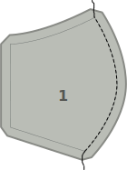
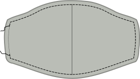
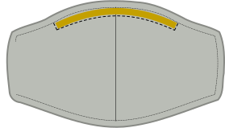

### Paso 1: Une la costura central

Une la costura curvada en el centro de nuestra mascarilla colocando los *derechos juntos* y cosiéndolos.

<Note>Repite este paso tanto para la tela exterior (principal) como para la tela interior (forro).</Note>

### Paso 2 (opcional): Plancha la costura central

<Note>

Este paso no tiene valor funcional, sólo hará que tu mascarilla se vea mejor.
Así que si te da igual, siéntete libre de saltártelo.

</Note>

Plancha la costura en la costura central abierta para que quede bonita y plana.

Como ésta es una costura curvada, no quedará plana. Pero se puede acercar la plancha desde al lado, y después hacer la segunda mitad desde el otro. También puedes usar un cojín de sastre para planchar.<Note>Repite este paso tanto para la tela exterior (principal) como para la tela interior (forro).</Note>

### Paso 3: Cosa la tela exterior al forro y una las cintas

Ahora coseremos la tela interior (forro) a la tela exterior (principal), y uniremos las cintas en un solo paso.

 - Pon el forro hacia abajo con el lado derecho hacia arriba.
 - Luego, pon dos cintas en las esquinas de un lado (como en nuestro ejemplo) para que sobresalgan un poco de la mascarilla, pero la cinta se extiende hacia dentro.
 - Ahora pon la tela principal encima con el derecho hacia abajo. Ahora deberías tener ambas capas de tu mascarilla una encima de la otra con *derecho juntos* y dos cintas enrolladas entre ellas
 - Pon alfileres a través de las cintas y las capas de tela para mantenerlas en su lugar
 - Ahora haz lo mismo en el otro lado

<Tip>

A medida que coges práctica, encontrarás que no necesitas poner alfileres puedes insertar las cintas cuando te acercas a la esquina.

</Tip>

Ahora cose alrededor de la mascarilla asegurándote de dejar un lado abierto para poder girarla hacia adentro más tarde.

<Warning>

Ten cuidado de no atrapar ninguna de las cintas en la costura aparte de donde deben estar cosidas.
Guíalas a través de la abertura que dejaste en un lado, o mételas entre
las capas de la mascarilla para mantenerlas apartadas.

</Warning>

### Paso 4: Vuelve la máscara dentro

Ahora, tu mascarilla está hacia adentro, así que tenemos que darle la vuelta.

Simplemente tira de la tela a través de la abertura que dejaste antes.

### Paso 5 (opcional): Plancha la mascarilla

<Note>

Este paso no tiene valor funcional, sólo hará que tu mascarilla se vea mejor.
Así que si te da igual, siéntete libre de saltártelo.

</Note>

Ahora que la mascarilla está terminada, es hora de plancharla. Before doing so, make sure to fold the seam allowance of the side we left open inwards, so that we press it flat as if it was sewn.

### Step 6: Close open side of the mask and edge-stitch around the edge

Now it's time to close the side of our mask the we left open to turn it inside out.

We are not merely going to close the opening, but also edge-stitch around the entire mask to give our mask some extra stability, and keep the lining at the back.

Make sure the open side is folded neatly inside, then edge-stitch around the entire mask.

### Step 7: Wear your mask or make a bunch

That's it, you're done! You can now wear your mask.

Even better, make a bunch so you can give others masks too.

