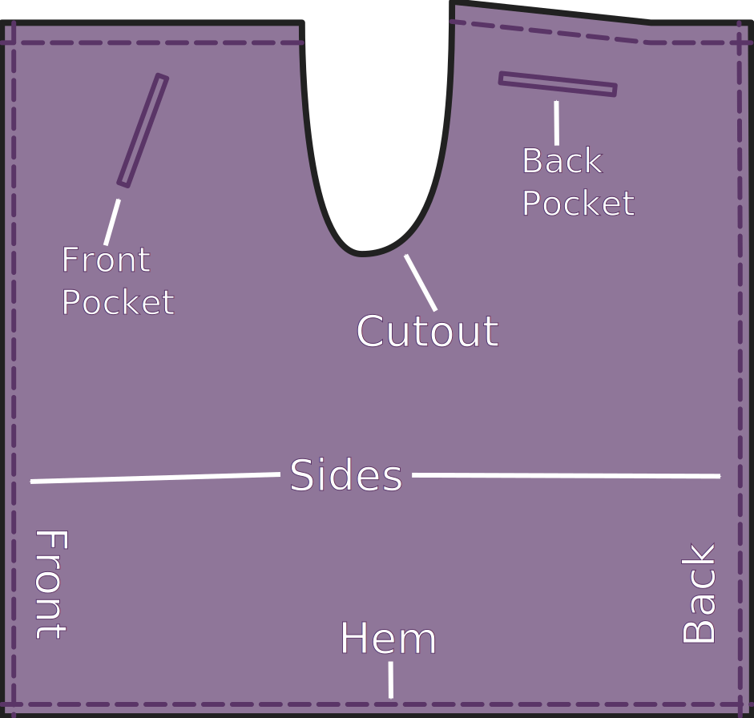
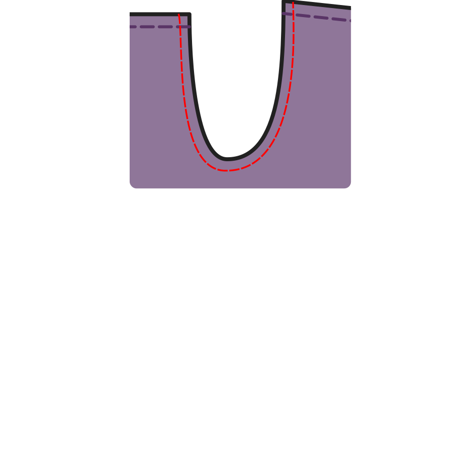

## Tips en opmerkingen

### Fabric

This is a type of wrap pants, which leaves the sides of your legs exposed at times. And as such, it is mostly worn in warmer weather, or inside. To get a good effect of the flowing of the legs, don't use very heavy materials. Good types of fabric are linen, and linen blends. These mostly have a nice drape and are cool. Heavy materials like denim are less useful.

### Waist band

Waralee is in some sense just a waist band with a long piece of fabric attached. The waist band needs to continue from the fabric into two strings of fabric that are used to tie the pants in the front and back. These strings are not included in the pattern. Traditionally, they are of similar length. You can make longer ones for the front panel, to allow you to tie both sets in the front. I prefer this as it is easier to tie, and you don't have the bulk of the knot in the back.

### Pockets

Traditionally, these types of pants do not have pockets. But I want to put my phone, keys and wallet somewhere. So I've included pockets in the pattern. You can decide for yourself if you would like them on your pants.

## Constructie

The construction of Waralee is very simple. It consists of these steps:

- Sew the pockets
- Sew (hem) the sides
- Hem the bottom
- Sew the two parts together at the crotch
- Sew the four strings
- Sew the waist band

### Pockets

These are optional. I included placements for the front pockets that will be hidden by the flaps in the front. But they will still be easily accessible to put your phone or keys in. These are single welt pockets. The ones in the front are at an angle and the ones in the back are horizontally oriented. The pocket templates should allow for enough fabric to attach the pocket to the waistband. If you want particularly deep pockets, please adjust accordingly.

### Sides and bottom

The sides and bottom need to be hemmed. You can use whatever method works best for you. In the version I first made I just serged the sides, folded them back and top stitched them. I did this to keep the bulk of the fabric to a minimum and allow for a better drape. What you do should depend on the type of fabric you're using.

### Crotch

Now you get to sew the two parts together. Lay them with the right sides together and sew the seam along the cutout. Finish this seam and press it.

### Strings

The strings are just long tubes of fabric. They should have the same width as you specified for the waistband, 2.5cm (1") by default. Cut out a strip of fabric twice that measurement plus a seam allowance, with the length of about a quarter of your waist measurement plus 40 cm (17") to make the knot. If you want to make the ones in the front longer, add half your waist measurement to those two.

If your material is delicate or flimsy, you can add some interfacing to this to give it strength.

Fold them in half along the long side, right sides together. Stitch the long side and one of the short sides, and turn the thing right side out. This can be made easier by taking a piece of twine longer than the strips. Lay that between the right sides, along the fold. Make sure you catch this while sewing the sort side. You can use this to pull the end through the tube you've created. When you're done, you can cut it off. Having a long, skinny stick can help too with this.

### Waist band

Now it is time to sew the waist band. Think about adding interfacing if your fabric is delicate. Fold the seam allowance in, and then fold along the waist band line. Insert one of the strings you made in the previous step on each side. Sew along the waist band line, and add some additional stitching to make sure those strings are attached well. They are the ones that keep your pants up, so having that stitching fail will result in awkward moments.

Press your pants, and try them on!

If you get stuck, or have additional questions, you can always reach out to [other FreeSewers](https://chat.freesewing.org/).

[How to Tie Wrap Pants](https://www.wikihow.com/Tie-Wrap-Pants "External link")
