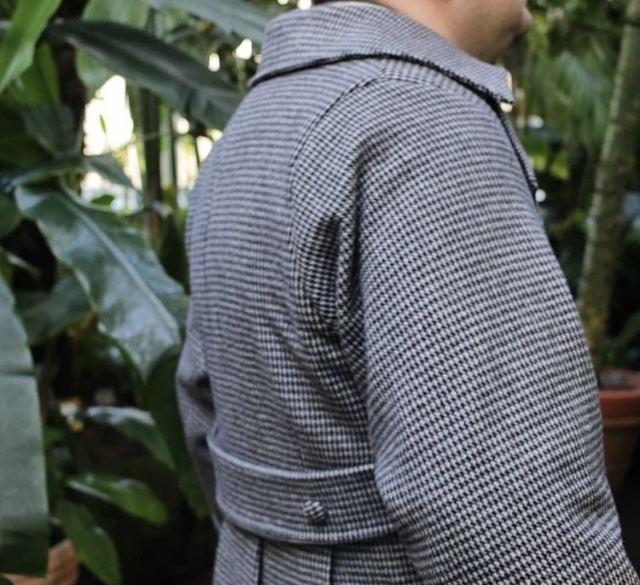
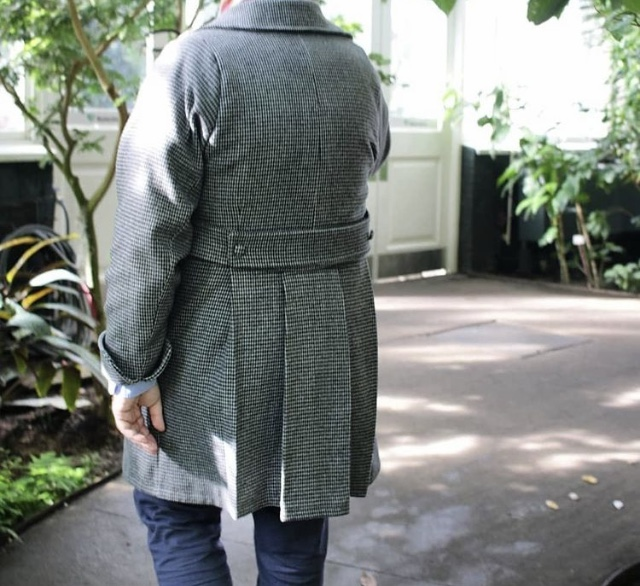
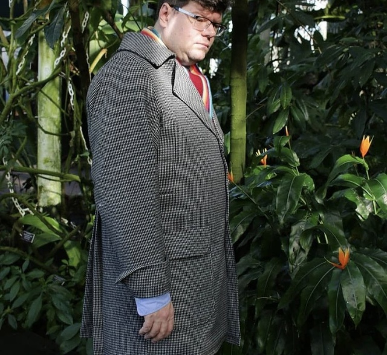

We adore this classy Carlton coat by Charlotte.

Charlotte teilte:

> Phil has got mean and moody coat modeling down to a fine art (ably assisted by the lighting at the NY Botanical Gardens). Wearing a @freesewing_org #CarltonCoat, in wool fabric from @barrys_fabrics, which was around a year in the making (admittedly with around an 8 month break in the middle).

We think it was a year well spent!

<Note>

Diese Bilder stammen von Charlotte, [@charlotteemmapatterns auf Instagram](https://www.instagram.com/charlotteemmapatterns/). Charlotte lässt sich auch auf der Webseite [Charlotte Emma Patterns](https://charlotteemmapatterns.com/) finden. We have reposted the pictures here with permission.

</Note>
