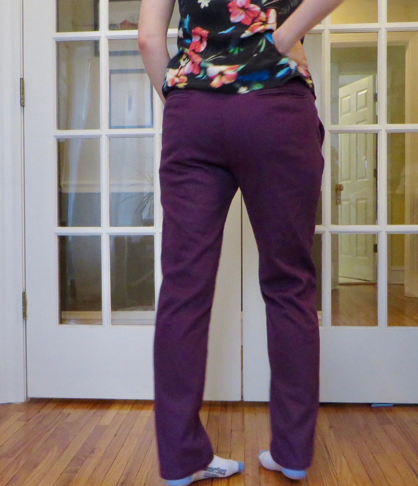
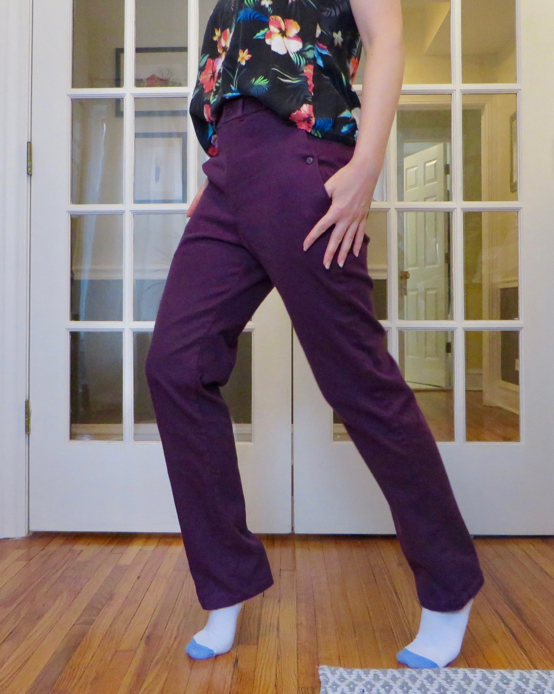
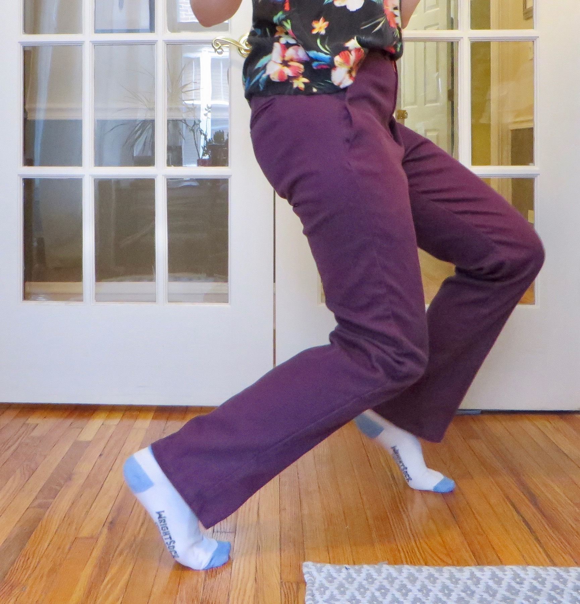

These Charlies were made in a purple stretch twill, with the rise as high as it would go (30%).

It's worth noting, stretch fabric is not recommended for the Charlie Chinos, and it caused a bit of trouble,
most notably, gaping in the pockets. This was resolved with the addition of twill tape along the pocket edges
and small buttons halfway up the pocket opening. 

On the plus side, the stretch makes them way better for dancing.

