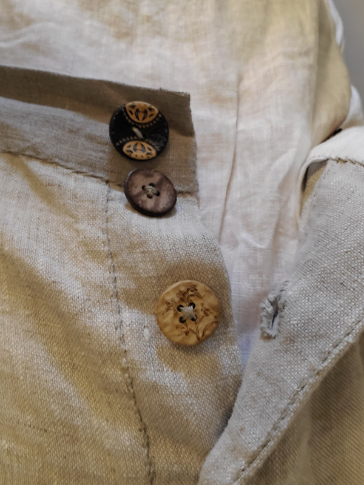

Drew S. made this cool pair of trousers in linen, their first FreeSewing pattern and also first time making trousers! Drew shared:

> I finished the Cornelius cycling breeches, my first freesewing make! It was my first time ever making trousers, so it was a struggle to wrap my head around the button fly. But it was completely worth it for a comfy pair of linen breeches!

> They turned out fairly loose in the waist, which is great [...] But I'm thinking about adding a cinch to the back, like you would see on the back of a vest, for days when I want it tighter

<Note>

This picture is from Drew S. on [Discord](https://discord.freesewing.org/). It is reposted here with permission.

</Note>
