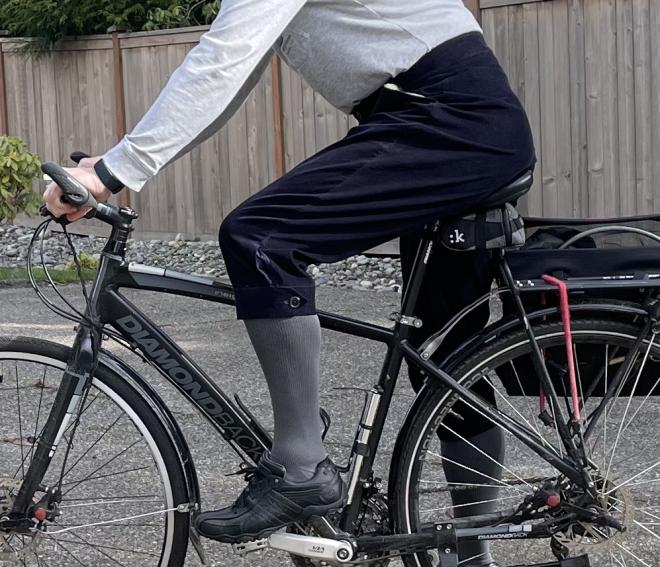
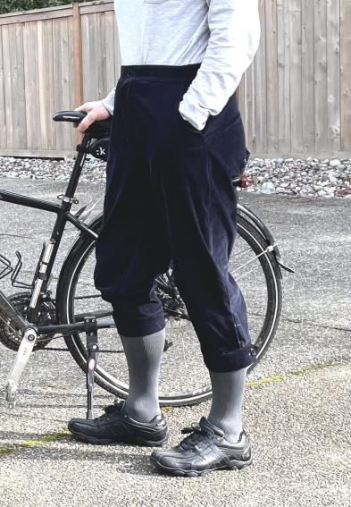

Wouter created the Cornelius cycling breeches pattern based on the Keystone systems. Read more [on the FreeSewing blog](https://freesewing.org/blog/cornelius-cycling-breeches/).

Wouter also shares on [the Instagram feed @Wouter.vdub](https://www.instagram.com/Wouter.vdub/) and [blogs at ShirtArtistry](https://shirtartistry.blog/).

<Note>

Cette photo provient de Wouter sur Discord. Elle est publiée ici avec son autorisation.

</Note>
