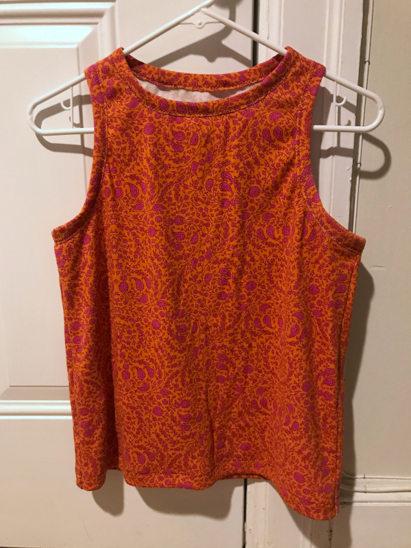
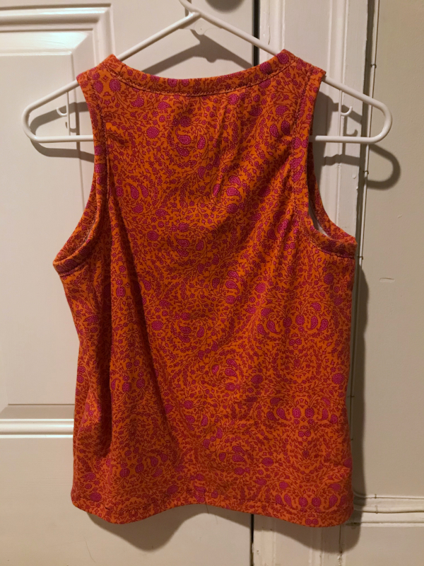

This Aaron tank top was made by Nat, who shared:

> I made an Aaron a-shirt! I didn't sew anything inside out, which is a testament to the clear and well-illustrated instructions. I used the default options and I'm very happy with the fit. The fabric is a mystery secondhand knit with two-way stretch. For the knit binding, I used a zigzag stitch on a regular sewing machine since I didn't have a twin needle or coverlock machine.

<Note>

This picture is from Nat on [Discord](https://discord.freesewing.org/). Hij werd hier gepost met toestemming.

</Note>
