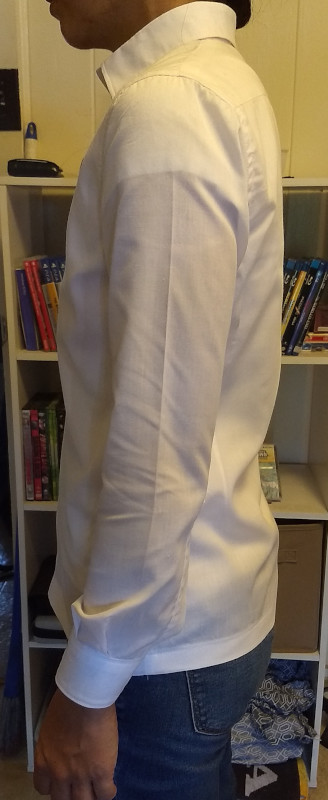
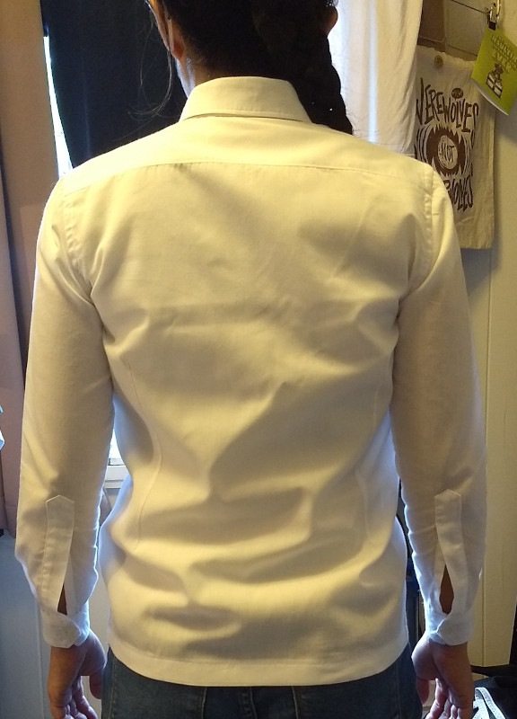

Ramoth made this fantastic first draft of the Simon shirt and generously shared some helpful fit notes. They said:

> Finished my first draft of the Simon! Collar was too tight and the sleeves could be a tiny bit longer, but otherwise the fit is great!

We love this illustration of the value of making a mockup of a complex garment. Even with the fit issues, we think it looks great and bet the next version will be even better!

<Note>

These pictures are from Ramoth on [Discord](https://discord.freesewing.org/). They are reposted here with permission.

</Note>
